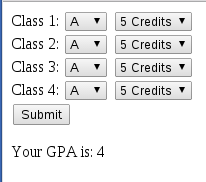
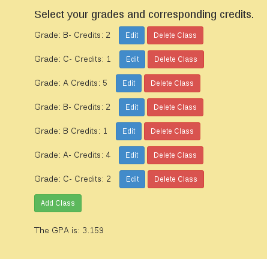

IntroAngularLab
===============
There are several goals in this lab:
   * Understand how to use Angular to create views and view-models for an ordinary JavaScript model
   * Understand the structure of an Angular app that makes sense
   * Understand how the HTML and Angular parts of the view relate to each other
   * Writing at least a couple tests in Mocha or Jasmine that can test your Angular code
   * Continue using HTML and CSS to make a page look decent and contain information you care about
   * Continue using Mocha tests

This starter code is meant to give you a structure where you can put your work.

The code in the "models" folder for Wordlists is part of an application I am creating for part of my research. I developed the model for wordlist using TDD (I wrote Mocha tests). I have given you these tests and the model that makes the tests pass. Along with Brian, I worked to update the code to remove any Mongo/Mongoose parts of the code so that you would not need to worry, yet, about how the 'M' of the MEAN stack works. For this lab, I really want you to focus on learning some new things in Angular. I will ask you to provide your code along with a description that explains how your code works. For each Angular feature you use, please describe a little bit about it.

I think there are probably lots of things you could do with Angular that involve ways to display or enter lists of words. Realistically, you would probably not put them all in one page, but that would be alright for this lab. You can make it so a user can enter and display multiple lists, choose only certain lists to include, choose several ways to provide input, show the output in numerous ways... be creative. If you prefer to have multiple pages, please feel free to do so, but make a home page that links to the other pages so that it's easy to navigate.

How you will be graded for this lab
===================================
You will earn points for:
   * (3 points) Consistent commits with pushes every-so-often
      * Commit and push right away to make sure everything worked correctly for your clone.
      * Your commits shoule be small - everytime you make a test pass, everytime you add a feature, everytime you update your textual description of your code with details about the Angular... commit!
   * (3) Good commit statements - This is a little bit subjective, but I'm looking for commits that actually explain how the project is different as a result fo the work you did.
   * (10 points) Good descriptions of five of the Angular features you included
      * These descriptions can be in the readme of your repository or in a text file in the repository.
      * Please use a heading to name the feature you will describe and clearly indicate it is one of your five features.
      * Please use complete sentences.
   * (20 points) Make use of five different Angular features - be sure to tell me which ones you wish to have graded by indicating in your description.
   * (10 points) Make tests for at least two of your Angular features.
   * (4 points) Explain a little bit about what your tests are checking.
   * (4 points) Include a list of at least 4 resources you found useful for completing the work in this lab (1 point for each). You may include more, but you will only get points for 4.

Setup
=====
   * Fork this project
   * Clone your forked repo to open the project in WebStorm
   * in the terminal: <code>npm install</code>
   * in the terminal: <code>bower install</code> (might need to be this> <code>./node_modules/bower/bin/bower install</code>)
   * set up nodemon:
      * A link to the github project can be found here: https://github.com/remy/nodemon
      * In this project, we have already installed nodemon, and it should be listed in package.json. If not: Install nodemon: <code>npm install --save-dev nodemon</code>
      * Configuration
        * You need to edit your configurations to create a nodemon configuration. Click the edit configurations in the upper right of the window (or under the 'Run' menu in the menubar).
        * Start by adding a new configuration (click the '+') with a node.js template. Set the javascript application to app.js (or server.js, depending on what you call it). You then need to have it run with the CoffeeScript plugin (even though we are not using CoffeeScript).
        * Set the path to the coffee executable to /node_modules/nodemon/bin/nodemon.js
        * Make sure you set the CoffeeScript parameters to <code>-e html,js,css,json</code> This tells nodemon to restart the server whenever a file with one of these extensions changes. (You may want to add other extensions if you use them frequently).

Some resources
==============
   * https://thinkster.io/egghead/testing-overview/ - video of testing a filter

GPA Calculator Image Examples
=============================

